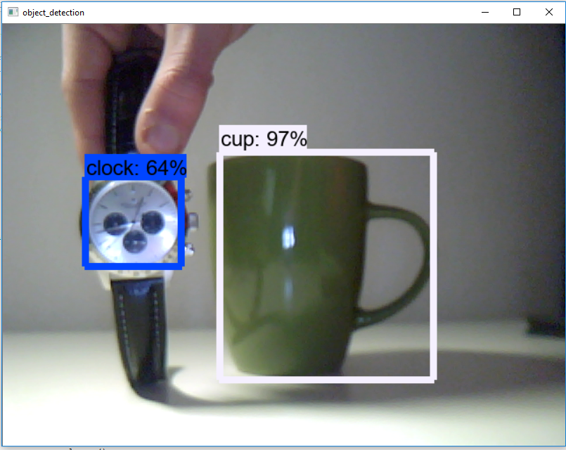

# Tensorflow Object Detection with Tensorflow 2


In this repository you can find some examples on how to use the Tensorflow OD API with Tensorflow 2. For more information check out my articles:
* [Tensorflow Object Detection with Tensorflow 2](https://gilberttanner.com/blog/object-detection-with-tensorflow-2)

## Installation

You can install the TensorFlow Object Detection API either with Python Package Installer (pip) or [Docker](https://www.docker.com/), an open-source platform for deploying and managing containerized applications. 

First clone the master branch of the Tensorflow Models repository:

```
git clone https://github.com/tensorflow/models.git
```

### Docker Installation

```
# From the root of the git repository (inside the models directory)
docker build -f research/object_detection/dockerfiles/tf2/Dockerfile -t od .
docker run -it od
```

### Python Package Installation

```
cd models/research
# Compile protos.
protoc object_detection/protos/*.proto --python_out=.
# Install TensorFlow Object Detection API.
cp object_detection/packages/tf2/setup.py .
python -m pip install .
```

> Note: The *.proto designating all files does not work protobuf version 3.5 and higher. If you are using version 3.5, you have to go through each file individually. To make this easier, I created a python script that loops through a directory and converts all proto files one at a time.

```python
import os
import sys
args = sys.argv
directory = args[1]
protoc_path = args[2]
for file in os.listdir(directory):
    if file.endswith(".proto"):
        os.system(protoc_path+" "+directory+"/"+file+" --python_out=.")
```

```
python use_protobuf.py <path to directory> <path to protoc file>
```

To test the installation run:

```
# Test the installation.
python object_detection/builders/model_builder_tf2_test.py
```

If everything installed correctly you should see something like:

```
...
[       OK ] ModelBuilderTF2Test.test_create_ssd_models_from_config
[ RUN      ] ModelBuilderTF2Test.test_invalid_faster_rcnn_batchnorm_update
[       OK ] ModelBuilderTF2Test.test_invalid_faster_rcnn_batchnorm_update
[ RUN      ] ModelBuilderTF2Test.test_invalid_first_stage_nms_iou_threshold
[       OK ] ModelBuilderTF2Test.test_invalid_first_stage_nms_iou_threshold
[ RUN      ] ModelBuilderTF2Test.test_invalid_model_config_proto
[       OK ] ModelBuilderTF2Test.test_invalid_model_config_proto
[ RUN      ] ModelBuilderTF2Test.test_invalid_second_stage_batch_size
[       OK ] ModelBuilderTF2Test.test_invalid_second_stage_batch_size
[ RUN      ] ModelBuilderTF2Test.test_session
[  SKIPPED ] ModelBuilderTF2Test.test_session
[ RUN      ] ModelBuilderTF2Test.test_unknown_faster_rcnn_feature_extractor
[       OK ] ModelBuilderTF2Test.test_unknown_faster_rcnn_feature_extractor
[ RUN      ] ModelBuilderTF2Test.test_unknown_meta_architecture
[       OK ] ModelBuilderTF2Test.test_unknown_meta_architecture
[ RUN      ] ModelBuilderTF2Test.test_unknown_ssd_feature_extractor
[       OK ] ModelBuilderTF2Test.test_unknown_ssd_feature_extractor
----------------------------------------------------------------------
Ran 20 tests in 91.767s

OK (skipped=1)
```

## Running a pre-trained model

The [object_detection_tutorial.ipynb](https://github.com/tensorflow/models/blob/master/research/object_detection/colab_tutorials/object_detection_tutorial.ipynb) notebook walks you through the process of using a pre-trained model to detect objects in an image. To try it out, I recommend to run it inside [Google Colab](https://colab.sandbox.google.com/github/tensorflow/models/blob/master/research/object_detection/colab_tutorials/colab_tutorials/object_detection_tutorial.ipynb).


## Modify code to run on a video stream

The above example can be easily rewritten to work with video streams by replacing the show_inference method with:

```python
import cv2
cap = cv2.VideoCapture(0) # or cap = cv2.VideoCapture("<video-path>")

def run_inference(model, cap):
    while cap.isOpened():
        ret, image_np = cap.read()
        # Actual detection.
        output_dict = run_inference_for_single_image(model, image_np)
        # Visualization of the results of a detection.
        vis_util.visualize_boxes_and_labels_on_image_array(
            image_np,
            output_dict['detection_boxes'],
            output_dict['detection_classes'],
            output_dict['detection_scores'],
            category_index,
            instance_masks=output_dict.get('detection_masks_reframed', None),
            use_normalized_coordinates=True,
            line_thickness=8)
        cv2.imshow('object_detection', cv2.resize(image_np, (800, 600)))
        if cv2.waitKey(25) & 0xFF == ord('q'):
            cap.release()
            cv2.destroyAllWindows()
            break

run_inference(detection_model, cap)
```



You can find the code as a [notebook](live_object_detection.ipynb) or [python file](detect_from_webcam.py).

## Few-shot learning

The new release also comes with [another notebook](https://github.com/tensorflow/models/blob/master/research/object_detection/colab_tutorials/eager_few_shot_od_training_tf2_colab.ipynb) showing us how to fine-tune a RetinaNet pre-trained model to detect rubber duckies with only 5 images and <5 minutes of training time in Google Colab.


## Author
 **Gilbert Tanner**